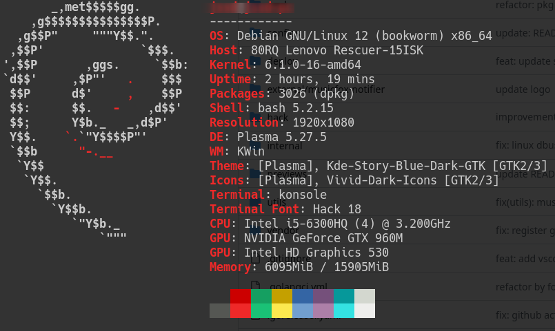
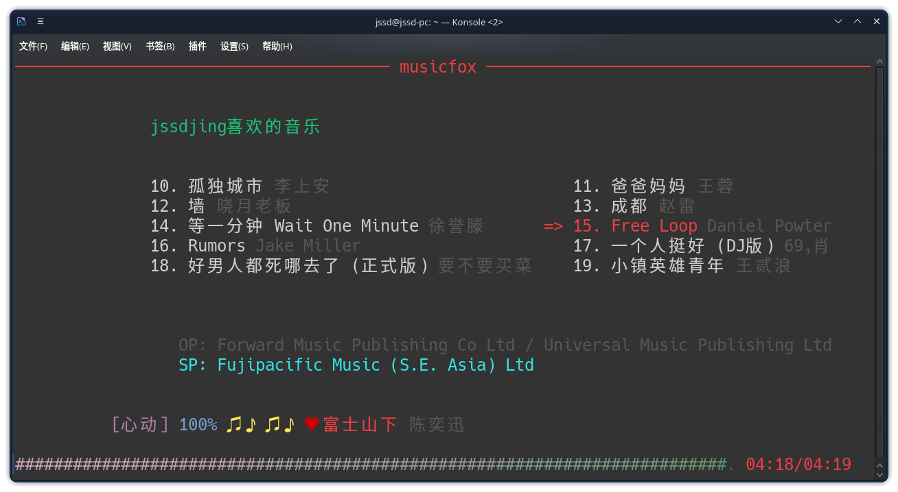

# 背景

> 网易云官网音乐将Linux安装包移除了
> 
> emmm  老子不玩了，找三方客户端
> 
> 在试过了yesplaymusic等三方客户端之后，发现都不可用，于是找到了一个命令行终端音乐播放器

<!--more-->

# 客户端地址

https://github.com/go-musicfox/go-musicfox

我的系统环境是 Debian12  amd64



去官方下载最新的安装包即可 [go-musicfox_4.3.0_linux_amd64.zip](https://github.com/go-musicfox/go-musicfox/releases/download/v4.3.0/go-musicfox_4.3.0_linux_amd64.zip)

## 解压

```bash
unzip go-musicfox_4.3.0_linux_amd64.zip
```

直接一个运行

报错！

## 解决问题

### 错误一

```log
Perhaps you should add the directory containing `flac.pc'
to the PKG_CONFIG_PATH environment variable
```

安装`flac`软件包

```bash
sudo apt install flac
```

### 错误二

```log
Package alsa was not found in the pkg-config search path. Perhaps you should add the directory containing `alsa.pc'
```

接着装

```bash
sudo apt-get update
sudo apt-get install libasound2-dev
```

### 错误三

```log
libFLAC.so.8: cannot open shared object file: No such file or directory
```

错误原因：`flac`在`Debian12`中默认安装的是`libFLAC.so.12.0.0`，而不是`libFLAC.so.8`，但他是兼容的，所以新建一个软链接即可解决。

```bash
sudo ln -s /usr/lib/x86_64-linux-gnu/libFLAC.so.12.0.0 /usr/lib/x86_64-linux-gnu/libFLAC.so.8
```

## 将命令添加到环境变量中

```bash
sudo ln -s /opt/go-musicfox_4.3.0_linux_amd64/musicfox /usr/local/bin/musicfox
```


# 运行效果




enjoy！！ :)
